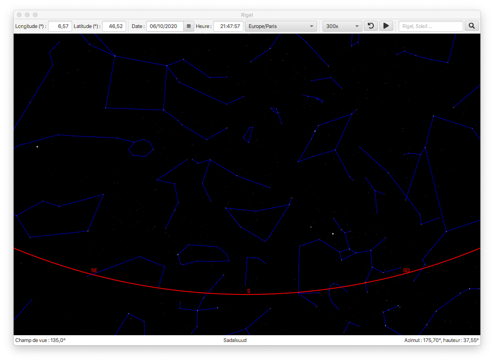

# Rigel

Rigel is a *Java* project that I develop for an EPFL academic course. It consists of a GUI that shows the sky map at a specific observation point (datetime and location). It can also animate the sky with a time accelerator.

I develop this project for the course ["Pratique de la programmation orientée objet"](https://cs108.epfl.ch/archive/20/) at [EPFL](https://www.epfl.ch/en/) during an academic exchange.

